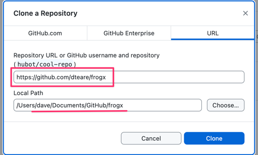

# FrogX

Welcome to Froggy Crossing! 🐸

## Setup

### Clone the repository

You'll need a GitHub account. [Sign up for GitHub](https://github.com/signup) and store the login details in [1Password](https://1password.com/). 

Then download [GitHub Desktop](https://desktop.github.com), launch, and select `File > Clone Repository` from the menu. Enter https://github.com/dteare/frogx under the `URL` tab and press `Clone` to copy all the files to your machine. 

You will be able to find them in the “Local Path”.

### Development environment

Install [Node.js](https://nodejs.org/en).

### Running the app

Open Terminal,`cd` into the project directory, and then run these commands:

- `npm install`
- `npm run dev`
- Open [http://localhost:8080/](http://localhost:8080/) in your web browser.
